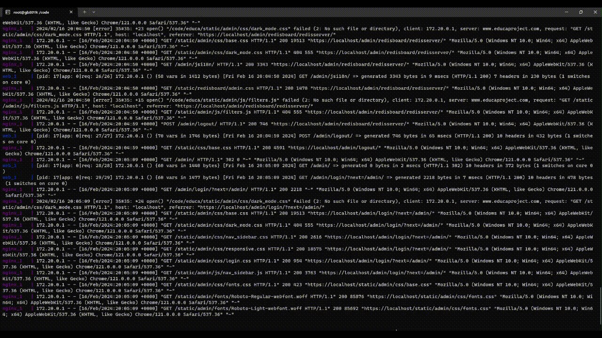
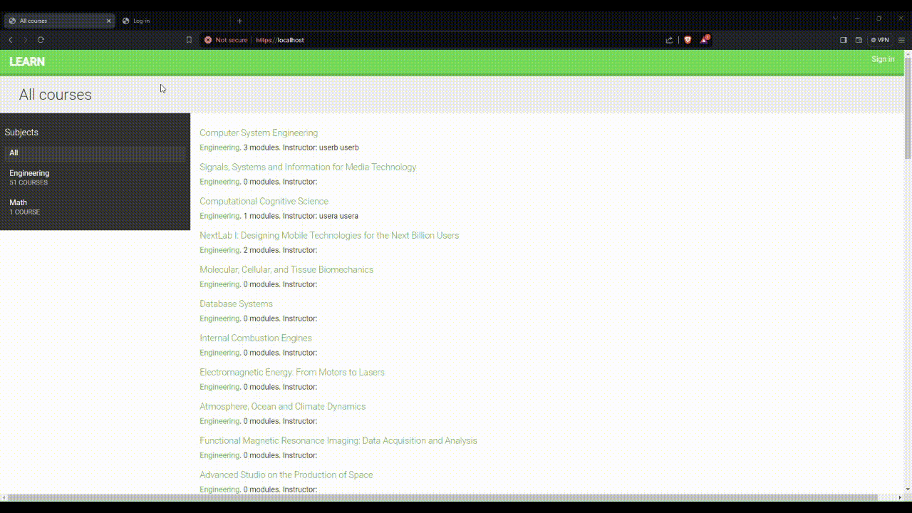
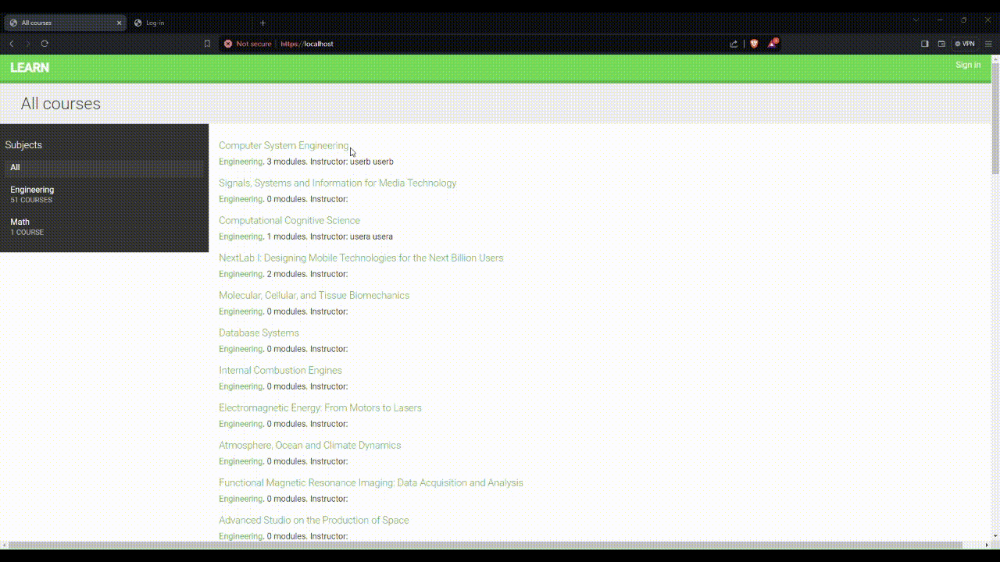
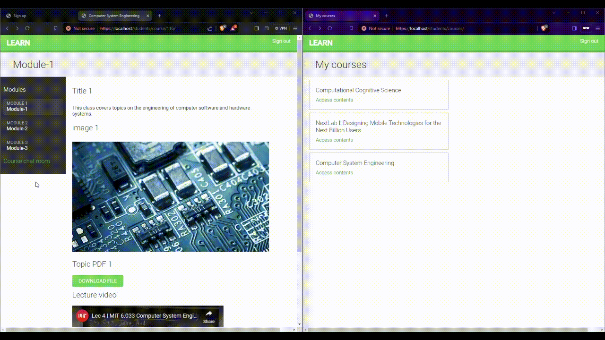

# E-Learning Platform with CMS using Django

This is a Django-based learning platform offers a robust Content Management System (CMS) for instructors to create and manage courses with flexibility. Utilizing model inheritance and generic relations, the platform supports a wide range of course content types. It features a comprehensive student registration system, enrollment management, a RESTful API, and a real-time chat server for students using Django Channels, enhancing the learning experience with asynchronous communication.

## Features

- **Flexible Course Content Models**: Leverage model inheritance and generic relations for versatile course creation. Utilised crafted webscraping tools to fetch sample course details from free and open learning platforms.
- **Instructor Dashboard**: A comprehensive system for instructors to manage courses and content efficiently.
- **Student Dashboard**: Easy registration and interactive dashboard allowing access to courses and course content.
- **RESTful API**: Extensive API for the e-learning platform.
- **Real-time Chat**: Django Channels-based chat rooms for interactive learning environments for the students.
- **Production Environment**: Docker Compose setup with NGINX, uWSGI, and Daphne for robust production deployment.

## Getting Started

### Prerequisites

Before setting up the project, ensure you have Docker installed on your system. For Docker installation instructions, visit [Docker's official documentation](https://docs.docker.com/get-docker/).

### Running the Application

To get the application up and running, follow these steps in your Linux terminal:

1. **Start the Application**

   ```bash
   docker-compose up
   ```

   This command builds, (re)creates, starts, and attaches to containers for the service.

2. **Stop the Application**

   To stop all running containers without removing them:

   ```bash
   docker-compose stop
   ```

3. **Stop and Remove Containers**

   To stop and remove all containers, networks, and volumes associated with the service:

   ```bash
   docker-compose down
   ```

Once the application is running, access it by navigating to `https://localhost` in your web browser.


## Demo GIFs
To give you a quick overview of the platform's capabilities, here are a few demonstrations:

1. **Django App Admin Page**

   

2. **Instructors' Functionality**

   

3. **Students' Course Access**

   

4. **Real-time Chat Functionality**

   

